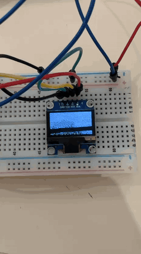

# Odyssey Trailer OLED — IMAX Framing



This project plays a video on a 128×64 monochrome SSD1306 OLED driven by an ESP32-S3. It includes a Python converter that crops, resizes, dithers, and packs frames into flash.

## Recommended setting

Use **IMAX 1.90:1** on the 128×64 OLED:

```
py convert_video.py your_video.mp4 --fps 5 --aspect imax190
```

The OLED is 2.00:1, so a 1.90:1 image uses approximately 122×64 pixels and leaves only about three black pixels on each side.

## IMAX 70mm framing

Use this only when the input video really contains a 1.43:1 expanded image:

```
py convert_video.py your_video.mp4 --fps 5 --aspect imax143
```

On the OLED, this produces an image approximately 92×64 pixels with large black bars on the left and right. It preserves the tall IMAX shape but uses less of the tiny display.

## Completely fill the screen

```
py convert_video.py your_video.mp4 --fps 5 --aspect fill
```

This crops the input to the OLED's exact 2.00:1 ratio. It fills every pixel but is not an official IMAX aspect ratio.

## Keep the video's original shape

```
py convert_video.py your_video.mp4 --fps 5 --aspect source
```

## Setup

Install the converter dependencies:

```
py -m pip install -r requirements.txt
```

Then run one of the conversion commands above (replace `your_video.mp4` with your legally obtained video file). The converter replaces:

- `odyssey_frames.h`
- `odyssey_frames.cpp`

Open `OdysseyTrailerOLED.ino` in Arduino IDE and upload normally.

## Controls

- Short press: pause/resume
- Hold for 1.2 seconds: restart
- The trailer repeats automatically

## Hardware

| Part | ESP32-S3 |
|------|----------|
| OLED GND | GND |
| OLED VDD | 3V3 |
| OLED SCK | GPIO8 |
| OLED SDA | GPIO9 |
| Button side 1 | GPIO4 |
| Button side 2 | GND |

**Tested with:**
- ESP32-S3 DevKitC-1 (16 MB flash)
- Arduino IDE 2.3+
- ESP32 Arduino core 3.0+
- Adafruit SSD1306 library 2.5+
- Adafruit GFX library 1.11+

**Requirements:**
- Flash Size: 16 MB
- Partition Scheme: Huge APP (3 MB) or similar
- Display: 128×64 SSD1306 (I2C)
- Frame rate: 5 FPS (configurable 1-15)
- Color: Monochrome (1-bit, ordered dithering)
- Audio: Not supported

At 5 FPS, each second uses 5,120 bytes. A 150-second video uses ~750 KiB of flash.

## Troubleshooting

| Issue | Fix |
|-------|-----|
| "Sketch too large" | Use "Huge APP" partition scheme or lower FPS to 4 |
| Wrong COM port | Check Tools → Port in Arduino IDE |
| OLED not showing | Verify I2C wiring (SDA=GPIO9, SCK=GPIO8) and 3V3 power |
| Converter fails | Ensure video is standard H.264 MP4; try `ffmpeg -i in.mp4 -c:v libx264 out.mp4` |
| Button doesn't work | Check GPIO4 to GND wiring; button is active-low with internal pullup |

## Personal note

I made this after watching *The Odyssey* in IMAX. I liked the contrast between a film made for one of the largest cinema formats and displaying it on a tiny 128×64 monochrome screen. It also gave me a reason to experiment with video conversion, dithering, flash limitations, and frame timing on the ESP32-S3.

## License

MIT